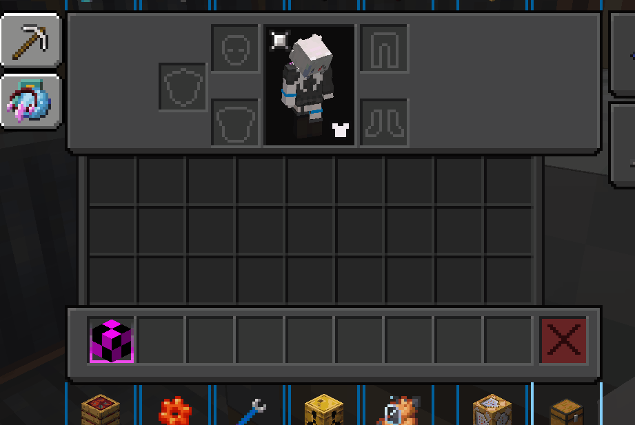
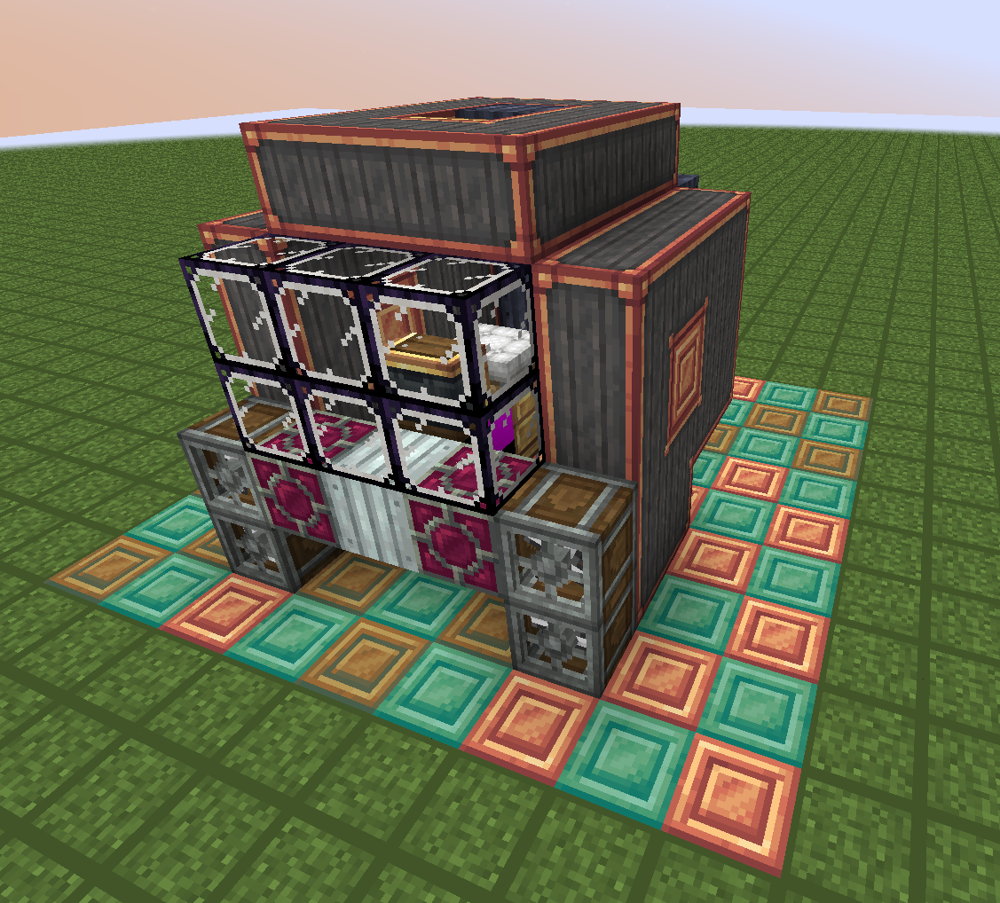

# Ponder

## 开始

> 脚本目录位于 客户端 `/kubejs/client_scripts`
>
> 在此文件内的任意地方都可以,但是更建议在 `client_scripts` 内创建一个 `Ponder` 文件夹,将你的 Ponder 脚本丢进去,而 Ponder 文件夹内还可以套文件夹用于进一步的整理与分类,养成分类的好习惯,会让你的编写更加方便
> 

和其他的 KubeJS 脚本一样,开头都应该先声明事件,所有的编写都在 `{}` 内进行,毕竟都是 Js 的扩展

```js
Ponder.registry((e) => {});
```

第一种(读取.nbt 文件进行编写)

> nbt 文件存储在 客户端 `/kubejs/assets/kubejs/ponder`

可以用 `Create Mod` 的蓝图与笔或者原版的结构方块获取 NBT 的结构(这俩自己学习用法,本教程并不会提及)

在获取一个完整的 nbt 结构文件时,最好把地板也一起搭建并打包好

可以打开 Ponder 的开发者模式,用于显示坐标(限制存档,新存档需要再次开启)


开启开发者模式后便可查看各个方块的坐标



## 准备阶段

在脚本中插入以下内容:

```js
Ponder.registry((e) => {
  e.create("kubejs:submarine_core") //
    .scene(
      "kubejs:submarine", // Ponder ID
      "潜水艇 ", // 侧边显示的标题
      "kubejs:submarine", // 读取的结构文件名称
      (scene, utils) => {}
    );
});
```

根据我们自己搭建的结构,以及 Ponder 场景中的地板坐标,大致推算出各个方块的位置(别在意我这个铜块生锈,忘记用涂蜡的铜块了 QwQ)



注意:

- 你地板的坐标 Y 轴是 0,所以要从 1 开始算

先让方块显示出来,我们在得先让地板显示出来,在 `{}` 内输入

```js
scene.showBasePlate();
scene.idle(20);
```

这里提一嘴: 在 Ponder 中 `scene.idle(20);` 的作用是停顿,例如显示完底盘等 1s 再继续显示,就写上这个,时间单位是`Tick` ,在 Minecraft 中 1Tick = 0.05s,因此停顿一秒就是 20Tick,关于 Tick 的更多信息可以到 [Minecraft Wiki](https://zh.minecraft.wiki/w/%E5%88%BB) 进行查看,这里不做过多的赘述

该停顿的地方就换行的地方就换行,该缩进的地方就缩进,不要为了贪图快捷而把该有的东西给漏了,要记住你做出来的东西是给人看的,以后痛苦的是自己,一定要养成好习惯!

> Erhai_lake 温馨提示:
>
> 代码如诗行千里路,规范编程点滴成风华.
> 技术路漫漫修行难,规范编码莫欠债.
> 欠技术债一时爽,还债还千年.
> 不把规范当玩笑,造福接手的程序员.
>
> 清晰注释似流水,变量命名如春风.
> 逻辑严密如古琴,Bug 修复似绣花.
> 代码洁净如明镜,函数单一如画框.
> 重构不停如江水,测试全面如明镜.
>
> 持续集成如黄金,部署自动如飞翔.
> 技术债务莫留下,规范编码当立志.
> 传承优良编程风,后人称赞无忧愁.
>
> 诗词大意:将编程与诗歌相提并论,强调了规范编程的重要性,在编程道路上,遵循规范就如同写诗一样,需要点滴积累,同时强调了一下技术之路的艰辛和规范编码的必要性,警示不要欠下技术债务,否则将来还债将是漫长的过程(甚至还不起),最后强调了规范编码的价值,不仅可以造福当前的程序员,也能为后人留下优良的编程风格.

如下面所示

```js
Ponder.registry((e) => {
  e.create("kubejs:submarine_core") //
    .scene(
      "kubejs:submarine", // Ponder ID
      "潜水艇 ", // 侧边显示的标题
      "kubejs:submarine", // 读取的结构文件名称
      (scene, utils) => {
        // 显示底盘
        scene.showBasePlate();
        scene.idle(20);
      }
    );
});
```

我们想要把鼓风机显示出来,那就打开 Ponder 场景以及看你的结构,根据信息我们得知右边的鼓风机的位置在 `[2,1,1]` ,那我们接着写

```js
// 显示底盘,同时停顿1秒钟
scene.showBasePlate();
scene.idle(20);
// 由动画的形式显示坐标为[2,1,1]的方块
scene.world.showSection([2, 1, 1], Direction.down);
```

这一段的代码是以动画从上面下落到坐标 `[2,1,1]` 的形式显示出这一格的方块,如果我们想要显示某区域的方块可以直接写

```js
scene.world.showSection([3, 1, 1, 1, 1, 3], Direction.down);
```

这样从 `[3,1,1]` 到 `[1,1,3]` 这一区域内的方块`(矩形)`全部都会以下落的方式展现出来
